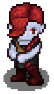

# Once Upon An Adventure

## Description
Once Upon an Adventure is an interactive learning experience.
Based on both RPG's and Choose Your Own Adventure games,
Once Upon an Adventure offers a variety of learning games that any child will enjoy.

## Table of Contents
* [Installation](#installation)
* [Usage](#usage)
* [License](#license)
* [Contributing](#contributing)
* [Links](#Links)
* [Tenchnologies](#Technologies)
* [Icebox](#Icebox)
* [Developers](#Developers)

## Installation
npm i
## Usage
You run this application in terminal or bash with server.js locally with 3000 in conjunction with Mongo.

 It is run not locally with heroku.

* License
MIT

## Contributing
No contributors allowed.

## Links
* GitHub repository URL: https://github.com/annaxgrace/once-upon-an-adventure
* Heroku deployed URL: https://onceuponanadventure.herokuapp.com/

## Technologies

### Languages 
* HTML, CSS, React.js, Node.js

### FrameWorks
* Bootstrap, Express, Canvas

### Dependencies

* bcryptjs
     - Encrypts our passwords for security
* howler
    - Allows our game to have sound

## Icebox

* Ability to have multiple game for each user
* New levels
* More items to buy
* More interactions/more sprites
* Castle throne room page
* A game log where you can see the whole story
* Winning and losing game sounds
* Add money for when you win
* Add media queries
* Mobile friendly
* Losing a heart if you lose

## Developers

### Anna Conover

* Github username: annaxgrace
* Email: anna.grace.conover@gmail.com
* GitHub Profile URL: https://github.com/AnnaxGrace

### Vinne Lopez

* Github username: vinnielo
* Email: vinnielo01@gmail.com
* GitHub Profile URL: https://github.com/vinnielo

### Julia "Jace" Clements

* Github username: tiiedye
* Email: tiiedye@gmail.com
* GitHub Profile URL: https://github.com/tiiedye

### Tony Garces

* Github username: T-nyG
* Email: antonio.a.garces@gmail.com
* GitHub Profile URL: https://github.com/T-nyG

### Erik Hirsch

* Github username: eh4git
* Email: ehirsch760@gmail.com
* GitHub Profile URL: https://github.com/eh4git

## Special thanks to Bryan Swarthout and Wilson Lam for their support and knowledge!

